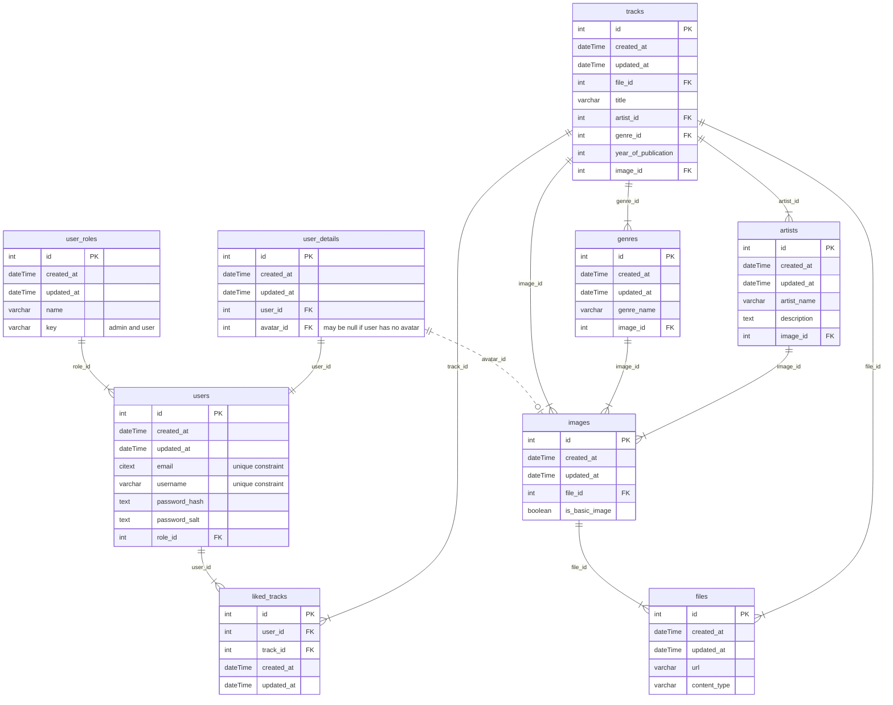

# SoundVault

Music Archive.

## 1. Introduction

SoundVault is your ultimate music sanctuary, a feature-rich app designed to be your musical haven. Whether you're a casual listener or an audiophile, SoundVault provides a platform that elevates your music experience. With a focus on user-friendly design, modern aesthetics, and intuitive features, SoundVault aims to make music storage, organization, and playback a breeze.

## 3. Requirements

- [NodeJS](https://nodejs.org/en) (18.x.x);
- [npm](https://www.npmjs.com/) (9.x.x);
- [PostgreSQL](https://www.postgresql.org/) (15.4)

## 4. Database Schema

User can become an artist once he adds music himself

## 5. Architecture

### 5.1 Global

#### 5.1.1 Technologies

1. [Typescript](https://www.typescriptlang.org/)
2. [npm workspaces](https://docs.npmjs.com/cli/v9/using-npm/workspaces)

### 5.2 Frontend

#### 5.2.1 Technologies

1. [React](https://react.dev/) — a frontend library
2. [Redux](https://redux.js.org/) + [Redux Toolkit](https://redux-toolkit.js.org/) — a state manager

#### 5.2.2 Folder Structure

1. assets - static assets (images, global styles)
2. libs - shared libraries and utilities

   2.1 components - plain react components

   2.2 enums

   2.3 helpers

   2.4 hooks

   2.5 packages - separate features or functionalities

   2.6 types

3. packages - separate app features or functionalities
4. pages - app pages
5. slices - redux slices

### 5.3 Backend

#### 5.3.1 Technologies

1. [Fastify](https://fastify.dev/) — a backend framework
2. [Knex](https://knexjs.org/) — a query builder
3. [Objection](https://vincit.github.io/objection.js/) — an ORM

#### 5.3.2 Folder Structure

1. db - database data (migrations, seeds)
2. libs - shared libraries and utilities

   2.1 enums

   2.2 exceptions

   2.3 helpers

   2.4 packages - separate features or functionalities

   2.5 types

3. packages - separate app features or functionalities

### 5.4 Shared Package

#### 5.4.1 Reason

As we are already using js on both frontend and backend it would be useful to share some contracts and code between them.

#### 5.4.2 Technologies

1. [Joi](https://github.com/sideway/joi) — a schema validator

## 6. How to Run

### 6.1 Manually

To run locally turn of ssl in the [file](backend/src/libs/packages/database/base-database.package.ts) - Just remove it from the clause all together.

1. Create and fill all .env files. These files are:

- frontend/.env
- backend/.env

You should use .env.example folder as a reference.

1. Install dependencies: `npm install`.

2. Run database. You can either run it in docker using command `docker-compose --env-file ./backend/.env -f docker-compose.services.yml up --build` or by installing postgres on your computer. Docker variant is preferred.

3. Apply migrations: `npm run migrate:dev -w backend`

4. Run backend: `npm run start:dev -w backend`

5. Run frontend: `npm run start:dev -w frontend`
